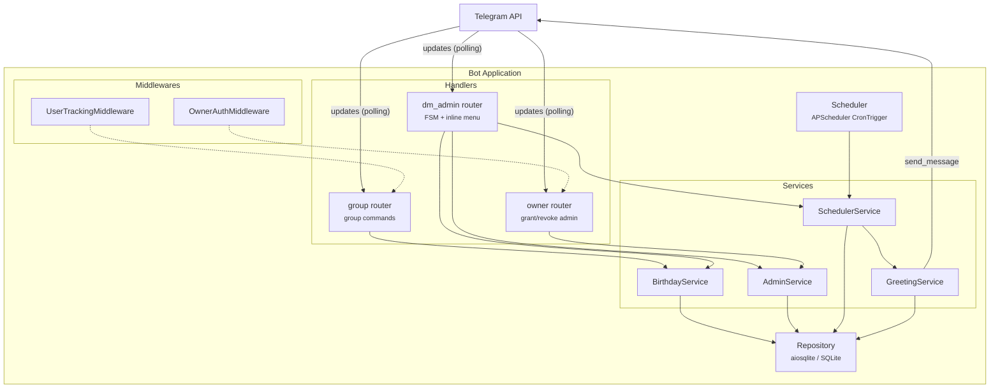
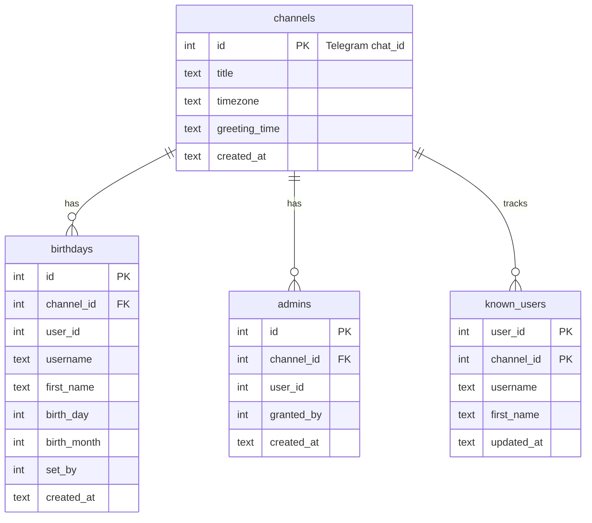
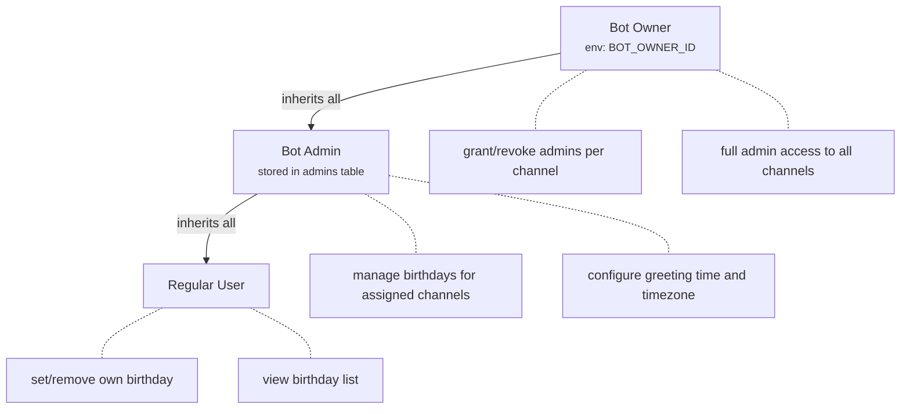
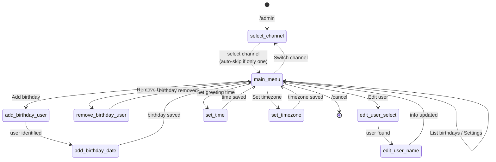
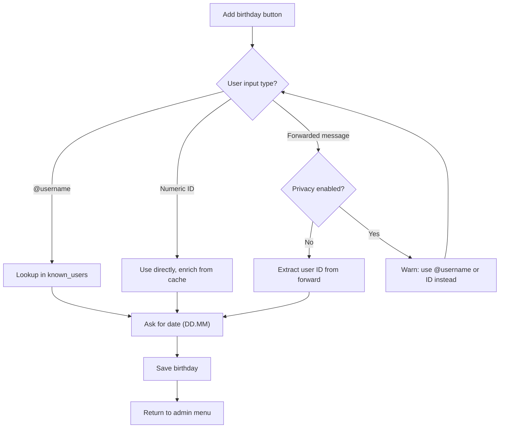
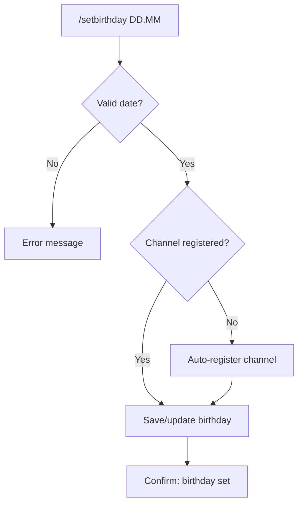
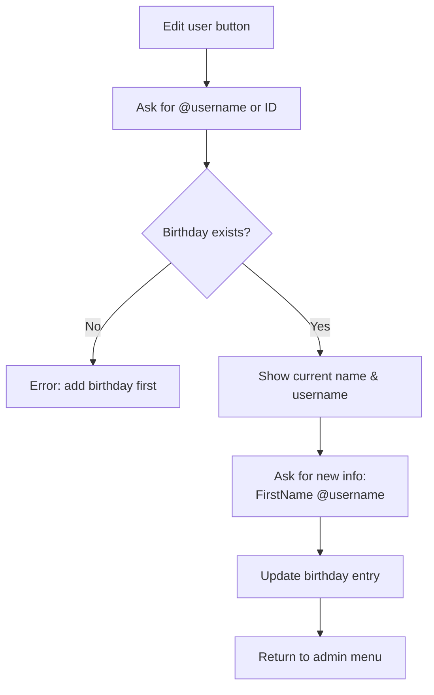

# Happy Birthday Telegram Bot - Architecture Document

## 1. Overview

A Telegram bot that tracks birthdays of channel/group participants and automatically posts congratulatory messages on their birthday. Birthdays can be set by individual users for themselves or by a designated bot admin for all participants via direct messages with the bot.

---

## 2. Key Requirements

| # | Requirement | Details |
|---|-------------|---------|
| 1 | Multi-channel support | Bot serves multiple groups/supergroups simultaneously, each with independent settings and birthday lists |
| 2 | Birthday data | Day + Month only (no year / age tracking) |
| 3 | Two entry modes | **Self-service:** any user sets their own birthday in the group; **Admin mode:** bot admin manages birthdays for others via DM inline menu |
| 4 | Configurable greeting time | Each channel admin configures the daily greeting time (HH:MM, 24h) |
| 5 | Single timezone per channel | One timezone setting per channel (IANA format); greeting time is evaluated in that timezone |
| 6 | Birthday list | Any member can view the list of birthdays for their channel |
| 7 | Text greetings | 100 built-in Russian text templates, randomly selected per birthday; text-only (no media) |
| 8 | No reminders | Greetings are posted only on the day of the birthday, no advance notifications |
| 9 | Minimal user commands | 4 group commands: set, view, list, remove birthday |
| 10 | Admin panel via DM | Inline keyboard menu for admin operations (add/remove/edit birthdays, configure settings) |
| 11 | User tracking | Bot caches user info from group messages to enable @username lookup in admin operations |
| 12 | Bot membership validation | Bot verifies it is still a member of managed channels; auto-cleans stale entries |

---

## 3. Tech Stack

| Component | Choice | Rationale |
|-----------|--------|-----------|
| Language | Python 3.11+ | Mature ecosystem, async support |
| Bot framework | **aiogram 3.x** | Modern async Telegram bot framework with middleware, routers, FSM |
| Database | **SQLite** (via aiosqlite) | Zero infrastructure, file-based, sufficient for the expected scale |
| Scheduler | **APScheduler** (AsyncIOScheduler) | Cron-like scheduling with timezone support, integrates with asyncio |
| Deployment | **Google Cloud e2-micro + systemd** | Always Free tier; a single long-running process with auto-restart |

---

## 4. High-Level Architecture



### Component Responsibilities

- **Handlers (Routers):** Three routers — `group` (group/supergroup commands), `dm_admin` (DM admin panel with FSM), `owner` (owner-only commands). Each router filters by chat type.
- **Middlewares:** `OwnerAuthMiddleware` blocks non-owners from owner commands; `UserTrackingMiddleware` caches user info from all group messages into `known_users`.
- **FSM (Finite State Machine):** Manages multi-step admin conversations in DM (11 states defined in `AdminFSM`).
- **Scheduler (APScheduler):** Fires greeting jobs at the configured time per channel using `CronTrigger` with timezone support.
- **Service Layer:** Contains business logic — birthday CRUD, greeting composition (100 templates), admin authorization, scheduler job management.
- **Repository Layer:** Abstracts all database access behind async methods; single `Repository` class.

---

## 5. Data Model

### 5.1 Tables

```sql
CREATE TABLE channels (
    id              INTEGER PRIMARY KEY,  -- Telegram chat_id
    title           TEXT,
    timezone        TEXT    NOT NULL DEFAULT 'UTC',
    greeting_time   TEXT    NOT NULL DEFAULT '09:00',  -- HH:MM format
    created_at      TEXT    NOT NULL DEFAULT (datetime('now'))
);

CREATE TABLE birthdays (
    id              INTEGER PRIMARY KEY AUTOINCREMENT,
    channel_id      INTEGER NOT NULL REFERENCES channels(id),
    user_id         INTEGER NOT NULL,     -- Telegram user_id
    username        TEXT,                  -- cached @username
    first_name      TEXT,                  -- cached first name
    birth_day       INTEGER NOT NULL,      -- 1-31
    birth_month     INTEGER NOT NULL,      -- 1-12
    set_by          INTEGER NOT NULL,      -- user_id of who set this
    created_at      TEXT    NOT NULL DEFAULT (datetime('now')),
    UNIQUE(channel_id, user_id)
);

CREATE TABLE admins (
    id              INTEGER PRIMARY KEY AUTOINCREMENT,
    channel_id      INTEGER NOT NULL REFERENCES channels(id),
    user_id         INTEGER NOT NULL,      -- Telegram user_id
    granted_by      INTEGER NOT NULL,      -- who granted admin
    created_at      TEXT    NOT NULL DEFAULT (datetime('now')),
    UNIQUE(channel_id, user_id)
);

CREATE TABLE known_users (
    user_id         INTEGER NOT NULL,
    channel_id      INTEGER NOT NULL,
    username        TEXT,                  -- current @username
    first_name      TEXT,                  -- current first name
    updated_at      TEXT    NOT NULL DEFAULT (datetime('now')),
    PRIMARY KEY (user_id, channel_id)
);
```

### 5.2 Entity Relationships



### 5.3 Design Notes

- The `known_users` table caches user info from group messages, enabling `@username` lookup for admin operations. It is refreshed on every message via the `UserTrackingMiddleware`.
- Birthday queries LEFT JOIN with `known_users` to retrieve the freshest names and usernames.

---

## 6. Bot Commands & Interactions

### 6.1 Group Commands (available in the channel/group chat)

| Command | Access | Description |
|---------|--------|-------------|
| `/start` | Everyone | Registers channel, shows bot introduction and help |
| `/setbirthday DD.MM` | Everyone | Set your own birthday |
| `/mybirthday` | Everyone | Show your currently set birthday |
| `/birthdays` | Everyone | List all birthdays for this channel |
| `/removebirthday` | Everyone | Remove your own birthday |

### 6.2 DM Admin Interface (private chat with the bot)

| Command / Action | Access | Description |
|---------|--------|-------------|
| `/admin` | Bot admin | Enter admin mode — select a channel, then interact via inline keyboard menu |
| `/cancel` | Bot admin | Exit any FSM state and reset conversation |

After selecting a channel via `/admin`, all further actions are driven by an **inline keyboard menu** (not text commands):

| Menu Button | Description |
|-------------|-------------|
| ➕ Add birthday | Set birthday for a user (accepts @username, numeric ID, or forwarded message) |
| ➖ Remove birthday | Remove a user's birthday (by @username or numeric ID) |
| 📋 List birthdays | List all birthdays for the channel |
| ✏️ Edit user | Edit a user's name/username on their birthday entry |
| 🕐 Set greeting time | Set daily greeting time (HH:MM, 24h) |
| 🌍 Set timezone | Set channel timezone (Region/City format) |
| ⚙️ Settings | View current channel settings (time, timezone) |
| 🔄 Switch channel | Switch to managing a different channel |

### 6.3 Owner Commands (bot superadmin, configured via env)

Owner commands are available in DM and require an active admin session (channel selected via `/admin`):

| Command | Access | Description |
|---------|--------|-------------|
| `/grantadmin @user` or `/grantadmin USER_ID` | Owner | Grant bot-admin role for the selected channel |
| `/revokeadmin @user` or `/revokeadmin USER_ID` | Owner | Revoke bot-admin role for the selected channel |

---

## 7. Admin Role Model



The **Bot Owner** is defined via the `BOT_OWNER_ID` environment variable. This is the person who deployed the bot and has superadmin access across all channels. Bot Admins are per-channel and stored in the database.

When listing channels for `/admin`, the bot validates its membership by calling `bot.get_chat()` for each channel and automatically removes stale channels from the database.

---

## 8. Greeting System

### 8.1 Scheduling Strategy

On bot startup and whenever channel settings change:

1. For each channel, an APScheduler `CronTrigger` job is created (or updated).
2. The job fires daily at the channel's configured `greeting_time` in the channel's `timezone`.
3. When the job fires, it queries birthdays matching today's day+month and sends greetings.

```python
# Pseudocode
scheduler.add_job(
    _greet_channel,
    CronTrigger(hour=H, minute=M, timezone=tz),
    id=f"greet_{channel_id}",
    args=[channel_id],
    replace_existing=True
)
```

### 8.2 Greeting Composition

When a birthday matches today:

1. Pick a random template from the 100 built-in Russian greeting templates (hardcoded in `GreetingService`).
2. Replace placeholders in the template:
   - `{name}` — `@username` if available, otherwise an HTML mention link with first name, or "друг" (friend) as fallback
   - `{username}` — `@username` if available, otherwise same as `{name}`
   - `{day}` — birthday day
   - `{month}` — birthday month name (English)
3. Send the composed text message to the channel via `send_message` (HTML parse mode).

### 8.3 Template Format

All greetings are text-only messages sent via `send_message`. Templates are defined as a list of 100 strings in `bot/services/greeting.py`. Media types (photos, GIFs, stickers) are not currently supported.

---

## 9. Conversation Flows (FSM)

### 9.1 Admin Managing via DM



### 9.2 Admin Adding Birthday



### 9.3 User Setting Own Birthday in Group



### 9.4 Admin Editing User Info



---

## 10. Project Structure

```
happy-birthday-bot/
├── bot/
│   ├── __init__.py
│   ├── __main__.py              # Entry point, wiring, startup/shutdown
│   ├── config.py                # Settings from env / .env file
│   ├── db/
│   │   ├── __init__.py
│   │   ├── database.py          # DB connection, schema, WAL mode
│   │   └── repositories.py      # Data access methods
│   ├── handlers/
│   │   ├── __init__.py          # register_handlers() for dispatcher
│   │   ├── group.py             # Group chat commands
│   │   ├── dm.py                # DM admin commands & FSM flows
│   │   └── owner.py             # Owner-only commands (grantadmin, revokeadmin)
│   ├── services/
│   │   ├── __init__.py
│   │   ├── birthday.py          # Birthday CRUD logic
│   │   ├── greeting.py          # 100 built-in templates & sending
│   │   ├── scheduler.py         # APScheduler setup & job management
│   │   └── admin.py             # Admin role checks & channel validation
│   ├── states/
│   │   ├── __init__.py
│   │   └── admin_fsm.py         # FSM states for admin flows (11 states)
│   ├── middlewares/
│   │   ├── __init__.py
│   │   └── auth.py              # OwnerAuthMiddleware, UserTrackingMiddleware
│   ├── keyboards/
│   │   ├── __init__.py
│   │   └── inline.py            # Inline keyboard builders & CallbackData
│   └── utils/
│       ├── __init__.py
│       └── date_helpers.py      # Date parsing, month names, timezone helpers
├── data/
│   └── birthdays.db             # SQLite database file (auto-created)
├── .env                         # BOT_TOKEN, BOT_OWNER_ID (gitignored)
├── .env.example
├── requirements.txt
├── README.md
├── DEPLOY.md                    # Google Cloud deployment guide
└── ARCHITECTURE.md              # This file
```

---

## 11. Configuration

All configuration is loaded from environment variables (`.env` file):

| Variable | Required | Default | Description |
|----------|----------|---------|-------------|
| `BOT_TOKEN` | Yes | - | Telegram Bot API token from @BotFather |
| `BOT_OWNER_ID` | Yes | - | Telegram user ID of the bot superadmin |
| `DB_PATH` | No | `data/birthdays.db` | Path to the SQLite database file |
| `DEFAULT_TIMEZONE` | No | `UTC` | Default timezone for new channels |
| `DEFAULT_GREETING_TIME` | No | `09:00` | Default greeting time for new channels |
| `LOG_LEVEL` | No | `INFO` | Logging level |

---

## 12. Deployment

### Google Cloud e2-micro (Always Free Tier)

The bot is deployed on a **Google Cloud Compute Engine e2-micro** instance, which is part of the Always Free tier ($0/month). See [DEPLOY.md](DEPLOY.md) for the full step-by-step guide.

**Key aspects:**
- Debian 12 VM with Python 3.11+, 1 GB RAM, 10 GB disk
- Dedicated `botuser` system user
- systemd service for auto-start and restart on failure
- No Docker — runs directly in a Python virtual environment
- Daily SQLite backup via cron

```ini
# /etc/systemd/system/birthday-bot.service
[Unit]
Description=Happy Birthday Telegram Bot
After=network.target

[Service]
Type=simple
User=botuser
WorkingDirectory=/home/botuser/birthday-bot
ExecStart=/home/botuser/birthday-bot/.venv/bin/python -m bot
Restart=always
RestartSec=5
EnvironmentFile=/home/botuser/birthday-bot/.env

[Install]
WantedBy=multi-user.target
```

### Polling vs Webhook

The bot uses **long polling** (aiogram default) to avoid the need for a domain, SSL certificate, or reverse proxy. No inbound ports are required — only outbound HTTPS to the Telegram API.

---

## 13. Error Handling & Reliability

| Concern | Approach |
|---------|----------|
| Bot crash / restart | systemd auto-restarts; APScheduler jobs are re-created on startup from DB state |
| Database corruption | SQLite WAL mode for safe concurrent reads; periodic backup via cron |
| Telegram API rate limits | aiogram built-in throttling |
| Greeting failures | Each birthday greeting is wrapped in try/except; failures are logged but don't block other greetings |
| Invalid user input | Input validation in handlers with user-friendly error messages |
| Stale channels | On `/admin`, bot validates membership via `get_chat()` and auto-removes stale channels |

---

## 14. Security Considerations

- **Bot token** is stored only in `.env`, never committed to version control.
- **Admin authorization** is checked via middleware before any admin command is processed.
- **Input sanitization:** all user-provided strings are escaped before being included in messages (aiogram handles HTML/Markdown escaping).
- **No sensitive data:** only Telegram user IDs, usernames, and day+month are stored. No passwords, no personal data beyond what Telegram exposes.
- **SQLite file permissions:** database file is readable/writable only by the bot process user.

---

## 15. Future Considerations (Out of Scope)

These are explicitly **not** part of the current architecture but could be added later:

- Year of birth / age display
- Pre-birthday reminders (1 day, 1 week before)
- Custom greeting templates per channel (DB-stored, with support for photos/GIFs/stickers)
- Belated greeting recovery on startup (greetings_log table to track what was sent)
- Web dashboard for managing birthdays
- Migration to PostgreSQL if scale demands it
- Localization / multi-language support (currently Russian templates only)
- Birthday statistics and analytics
